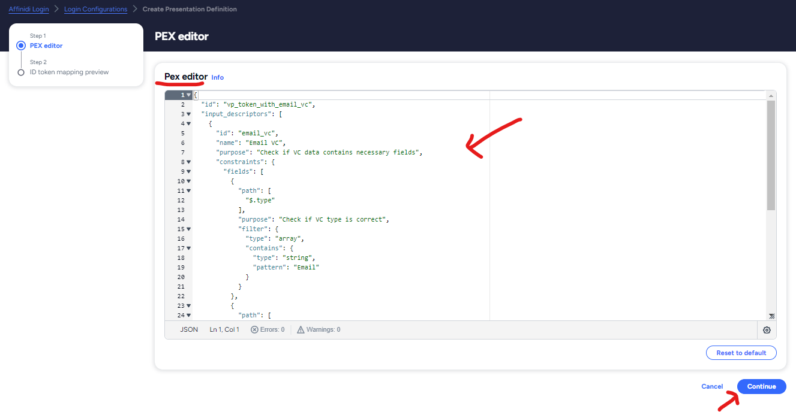
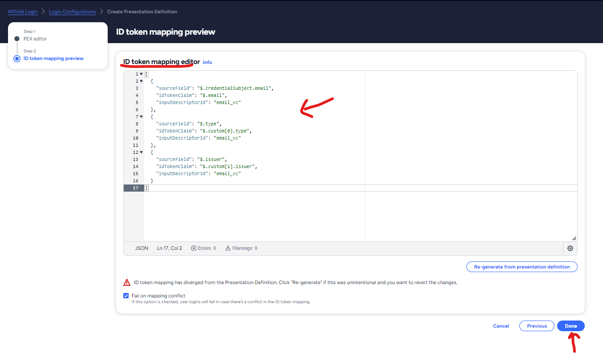

# Overview

**AUGMENT EXPERIENCES WITH A SAFER, SIMPLER AND MORE PRIVATE WAY TO LOGIN**

A paradigm shift in the registration and sign-in process, Affinidi Login is a game-changing solution for developers. With our revolutionary passwordless authentication solution your user's first sign-in doubles as their registration, and all the necessary data for onboarding can be requested during this streamlined sign-in/signup process. End users are in full control, ensuring that they consent to the information shared in a transparent and user-friendly manner. This streamlined approach empowers developers to create efficient user experiences with data integrity, enhanced security and privacy, and ensures compatibility with industry standards.

| Passwordless Authentication | Decentralised Identity Management | Uses Latest Standards |
|---|---|---|
| Offers a secure and user-friendly alternative to traditional password-based authentication by eliminating passwords and thus removing the vulnerability to password-related attacks such as phishing and credential stuffing. | Leverages OID4VP to enable users to control their data and digital identity, selectively share their credentials and authenticate themselves across multiple platforms and devices without relying on a centralised identity provider. | Utilises OID4VP to enhance security of the authentication process by verifying user authenticity without the need for direct communication with the provider, reducing risk of tampering and ensuring data integrity. |

# Affinidi Login Integration Guide for WIX Sites

Simplify the integration of `Affinidi Login` into your Wix Sites.
This uses [openid-connect](https://www.npmjs.com/package/openid-client) npm package with PKCE Flow which reduces the risk of client secret management.

## OAuth Flow

The diagram below shows the flows involved in establishing an authenticated user session on a Wix site using Affinidi as an OAuth identity provider. 


## Prerequisites

Before getting started, make sure you have the following prerequisites:

1. Install [Affinidi Vault](https://docs.affinidi.com/labs/affinidi-login-basic/#before-you-begin-i-classfa-solid-fa-stari) to discover, collect, store, share, and monetise your data with consent.

2. Create Login configuration using the link [here](https://docs.affinidi.com/docs/affinidi-login/login-configuration/#using-affinidi-portal) by giving 
    - Name as `Wix Site` 
    - redirect-uri as `https://{WIX_SITE}/_functions/getAuthCallback` e.g. `https://parameshk9.wixsite.com/paramesh-affinidi/_functions/getAuthCallback`
    - Authentication Mode as `None`, This enables PKCE flow
    - Click on Create new for updating PEX & ID Token mapping
        
    - Paste the below Presentation Definition in Pex Editor and ID token mapping in ID token mapping editor and Click on Done
        
        
    - Click on Create button to create login configuration
        
    - Copy the Client ID, Issuer URL; you'll need them in next step        
        

*Presentation Definition*
```
{
  "id": "vp_token_with_email_vc",
  "input_descriptors": [
    {
      "id": "email_vc",
      "name": "Email VC",
      "purpose": "Check if VC data contains necessary fields",
      "constraints": {
        "fields": [
          {
            "path": [
              "$.type"
            ],
            "purpose": "Check if VC type is correct",
            "filter": {
              "type": "array",
              "contains": {
                "type": "string",
                "pattern": "Email"
              }
            }
          },
          {
            "path": [
              "$.credentialSubject.email"
            ],
            "purpose": "Check if VC contains email field",
            "filter": {
              "type": "string"
            }
          },
          {
            "path": [
              "$.issuer"
            ],
            "purpose": "Check if VC Issuer is Trusted",
            "filter": {
              "type": "string",
              "pattern": "^did:key:zQ3shtMGCU89kb2RMknNZcYGUcHW8P6Cq3CoQyvoDs7Qqh33N"
            }
          }
        ]
      }
    }
  ]
}
```

*ID Token Mapping*
```
[
  {
    "sourceField": "$.credentialSubject.email",
    "idTokenClaim": "$.email",
    "inputDescriptorId": "email_vc"
  },
  {
    "sourceField": "$.type",
    "idTokenClaim": "$.custom[0].type",
    "inputDescriptorId": "email_vc"
  },
  {
    "sourceField": "$.issuer",
    "idTokenClaim": "$.custom[1].issuer",
    "inputDescriptorId": "email_vc"
  }
]
```

3. An active WIX account and a WIX site where you intend to integrate Affinidi Login with Development Mode On.

4. Open the [Wix Secrets Manager](https://manage.wix.com/dashboard) to securely store the configs. This is more secure than pasting them into backend code.

Create a new secret called `affinidi-sso-credentials`.

Copy-paste the below content, replace client id, issuer url with the value obtained in previous step:
```
{
  "client_id": "<YOUR_CLIENT_ID>",
  "issuer": "<ISSUER_URL>",
  "code_verifier": "<ANY_43_CHARACTER_LENGH_SECRET_STRING>"
}
```

Sample value should look like: 
```
{
    "client_id": "18b556d6-81fd-44d2-9de9-829beb95bf06",
    "issuer": "https://427cc658-ddf8-4e5e-93b3-c038c13fac19.apse1.login.affinidi.io",
    "code_verifier": "affinidissoabc-klDgGJkAEho7OMAu1qG02LKlFEfPWJztMaq2Lb7b8hI"
}
```


## Integration Setup

1. By default Wix does not allow any changes to Signup/Login Pages, To make the customization change the signup/login page form type from `Default` to `Custom Form` from menu item `Pages & Menu -> Signup & Login`

    

2. Create a new blank Page with the name `Affinidi LoggedIn` and Add some text like `Please Wait, We are logging you in....` and hide that page from menu item. This pages acts as Loading page and does the auto-login to Wix site once user is created.

**Note**: Make sure the URL of the above should be `/affinidi-loggedin`

    

3. Install the npm package `openid-client` by clicking on menu `Packages & Apps`

    

4. Open `Public & Backend` menu option to write frontend & backend code in Wix

Folder Structure should look like below, and you can copy the code for each file from [here](./wix-code)
```
-- Public
    -- affinidi             /* Add folder */ 
        - client.js         /* Add new js file */ 
        - util.js           /* Add new js file */ 
-- Backend
    -- affinidi             /* Add folder */ 
        - affinidi.web.js   /* Add new web module file */ 
        - auth.js           /* Add new js file */ 
    - http-functions.js     /* Add js file, ignore it if already exists */ 
```
    


5. Open the `Custom Signup` and Add Element of type `Icon Button` with the below settings
    - Regular image as 
    - Hover image as 
    - Clicked image as 
    - Tooltip as `Affinidi Login`
    - ID as `affinidiLogin`
    - Add OnClick handler for the button, and below is the code for a button click 
    
```
import { getAuthUrl } from 'public/affinidi/client.js';
import wixLocationFrontend from 'wix-location-frontend';

export async function affinidiLogin_click(event) {
  $w('#affinidiLogin').disable();
	console.log('Signup Page, Affinidi Login button clicked');
  try {
      const url = await getAuthUrl();
      wixLocationFrontend.to(url);

  } catch (error) {
      console.error(error);
  }
	$w('#affinidiLogin').enable();
}
```


6. Open the `Custom Login` and Add Element of type `Icon Button` with the below settings
    - Regular image as 
    - Hover image as 
    - Clicked image as 
    - Tooltip as `Affinidi Login`
    - ID as `affinidiLogin2`
    - Add OnClick handler for the button, and below is the code for a button click 

```
import { getAuthUrl } from 'public/affinidi/client.js';
import wixLocationFrontend from 'wix-location-frontend';

export async function affinidiLogin2_click(event) {
  $w('#affinidiLogin2').disable();
	console.log('Login Page, Affinidi Login button clicked');
  try {
      const url = await getAuthUrl();
      wixLocationFrontend.to(url);

  } catch (error) {
      console.error(error);
  }
	$w('#affinidiLogin2').enable();
}
```


7. (Optional) If you want to add Affinidi Login Button on the Header Menu (which displays button on all pages), then open the `Home` Page and Add Element of type `Icon Button` on Header Menu with the below settings
    - Regular image as 
    - Hover image as 
    - Clicked image as 
    - Tooltip as `Affinidi Login`
    - ID as `affinidiLoginMain`
    - Add OnClick handler for the button

And Open the `MasterPage.js` file and add the below code, which hides the button when user is logged-in, and Onclick handler for the login button.

```
import { getAuthUrl } from 'public/affinidi/client.js';
import wixLocationFrontend from 'wix-location-frontend';
import wixUsers from 'wix-users';

$w.onReady(function () {
	if(wixUsers.currentUser.loggedIn) {
		$w('#affinidiLoginMain').hide();
	}
});

export async function affinidiLoginMain_click(event) {
  $w('#affinidiLoginMain').disable();
	console.log('Header, Affinidi Login button clicked');
  try {
      const url = await getAuthUrl();
      wixLocationFrontend.to(url);

  } catch (error) {
      console.error(error);
  }
	$w('#affinidiLoginMain').enable();
}
```


7. Open the `Affinidi LoggedIn` and add the below code 
```
import { applyToken } from 'public/affinidi/client.js'
import wixUsers from 'wix-users';
import wixLocationFrontend from 'wix-location-frontend';

$w.onReady(function () {
	console.log('Affinidi Logged-in page initiated');
	applyToken().then(() => {
        // Gets user email
        wixUsers.currentUser.getEmail().then((email) => {
            console.log('user logged in', email);
        });
		    wixLocationFrontend.to('/account/my-account');		
    }).catch(error => {
		  console.error('error ', error);
		  wixLocationFrontend.to('/');
	  });

});
```


8. Save the changes and publish it, Open site URL and click on `Affinidi Login` button under Signup/Login Page/Home Page

Login Page

Signup Page

Consent Screen

Accounts page post login Success


