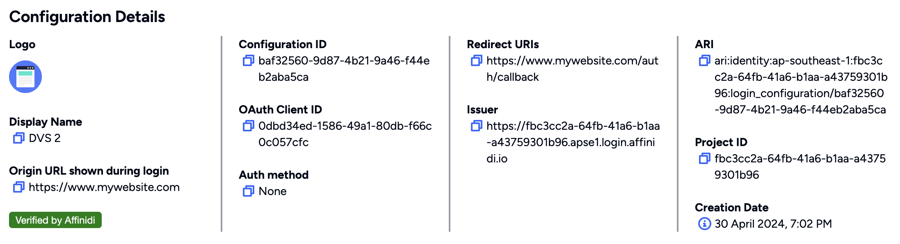

# WIX - Enable Domain Verification Service

Below are the steps will guide you on enabling Domain Verification Service on WIX sites, Learn more about Domain Verification Service [here](https://docs.affinidi.com/docs/affinidi-elements/domain-verification/)

## Download did:web Document

1. Login to [portal.affinidi.com](http://portal.affinidi.com/) and go to Affinidi Login

2. Open the Login Configuration if you would like to have the domain verified.

3. Click on the Verify button in the Configuration Details section

    

4. Confirm that the domain value is correct and click on Continue button.

    *Note*: If you need to update the value, click on the Login Configuration Detail link and update the Origin URL field.

    

4. The service will generate the required **did:web** document. Download the **did:web** document.

    

## Host document on your WIX Store

WIX has certain limitations when it comes to hosting custom files in specific directories like `.well-known`, but there are alternatives one of simpler way is an upload `did.json` document as Media and Add a redirection rule.

Follow the steps

1. Open your Wix Editor and upload `did:web` (*did.json*) document

    

2. Copy the URL of the uploaded `did.json` document 

    

3. Open Wix Dashboard and Then, under SEO Tools, click on URL Redirect Manager

    

4. Add redirect rule, Click on `+ New Redirect` and enter details as mentioned below 
  - `Old URL` as your `/.well-known/did.json`
  - `New URL` as media URL of the uploaded did document

    

5. Click Save to apply the redirect rule, This will ensure that when someone visits e.g. https://parameshk9.wixsite.com/.well-known/did.json, they will be redirected to the new URL where your `did.json` is hosted.

6. We can test the redirection by clicking on `View redirect` button
  
    **Note**: 301 redirections won't work without custom domains

    

7. If redirection working fine, then Click on `I've hosted it` button on the Affinidi Portal 

    

8.  Once successful, the Login Configuration will be updated with a verified domain, and the same verified tag will be reflected on Affinidi Vault’s consent page when users share their data.

    

9. Once Affinidi verifies the domain, users will see a verified checkmark on the Consent screen of the Affinidi Vault when sharing their data, increasing user trust and providing better user experience.

    

